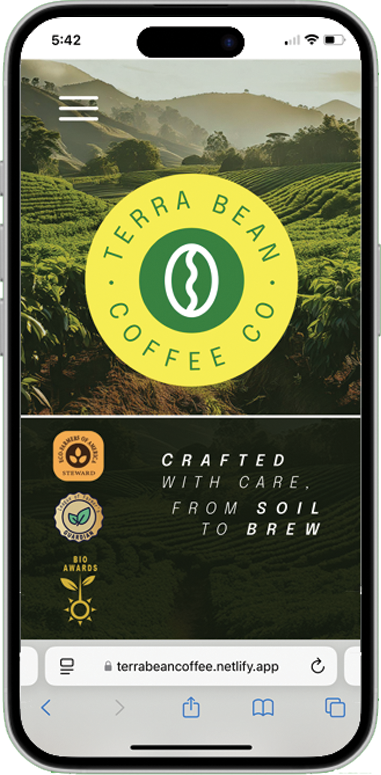
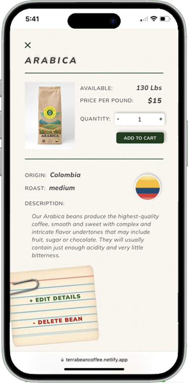
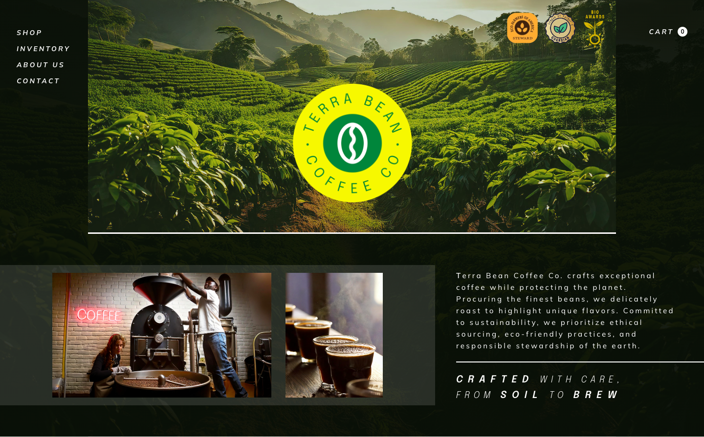

# Terra Bean Coffee Co. 🎨🚀  

**Live Demo:** 👉 [View on Netlify](https://terrabeancoffee.netlify.app)  

#### A coffee bean roasters website, this project was a practice in design, as well as front end programming. Application has full CRUD capability, a shopping cart, navigation bar, and explores movement of UI elements with scrolling. Designed in Figma, with AI images, graphics, and logo manipulated in Photoshop. The origins of this project are from an application prompt for tracking inventory for a small online retailer. Inventory functionality, as well as admin duties, are displayed on index cards.

---

## Technologies Used

- 🌐 React.js
- ⚡ Vite
- 🟨 Javascript
- 🔶 HTML
- 🎨 CSS
- 📦 npm
- 🔍 eslint

### **Design Tools**
-  Figma
-  Illustrator
-  Photoshop

---

## Screenshots

### Mobile Views

  
  

### Desktop View  

    

---

## Setup/Installation Requirements

* Clone this repository to your desktop.
* $ npm install to install dependencies.
* $ npm run dev to start development server.
* $ npm run build to compile the project.

## Deployment  
This project is deployed using **Netlify**. Click the link below to see it live:  
🌍 [Live Site](https://yourproject.netlify.app)  

## Known Bugs

* If any issues are discovered, please email jenniferlholcomb@gmail.com.

## Contributing

Contributions are welcome! To contribute:

1. Fork the repository.
2. Create a new branch (`git checkout -b feature-branch`).
3. Commit your changes (`git commit -m 'Add new feature'`).
4. Push to the branch (`git push origin feature-branch`).
5. Open a Pull Request.

---

## License

MIT License

Copyright (c) 2025 Jennifer Holcomb

Permission is hereby granted, free of charge, to any person obtaining a copy of this software and associated documentation files (the "Software"), to deal in the Software without restriction, including without limitation the rights to use, copy, modify, merge, publish, distribute, sublicense, and/or sell copies of the Software, and to permit persons to whom the Software is furnished to do so, subject to the following conditions:

The above copyright notice and this permission notice shall be included in all copies or substantial portions of the Software.

THE SOFTWARE IS PROVIDED "AS IS", WITHOUT WARRANTY OF ANY KIND, EXPRESS OR IMPLIED, INCLUDING BUT NOT LIMITED TO THE WARRANTIES OF MERCHANTABILITY, FITNESS FOR A PARTICULAR PURPOSE AND NONINFRINGEMENT. IN NO EVENT SHALL THE AUTHORS OR COPYRIGHT HOLDERS BE LIABLE FOR ANY CLAIM, DAMAGES OR OTHER LIABILITY, WHETHER IN AN ACTION OF CONTRACT, TORT OR OTHERWISE, ARISING FROM, OUT OF OR IN CONNECTION WITH THE SOFTWARE OR THE USE OR OTHER DEALINGS IN THE S

## Contact

👤 Jennifer Holcomb  
📧 Email: jenniferlholcomb@gmail.com  
🖥️ [Portfolio Website](https://jenholcomb.netlify.app) 
🔗 [LinkedIn](https://www.linkedin.com/in/jennifer-holcomb-pdx/)
